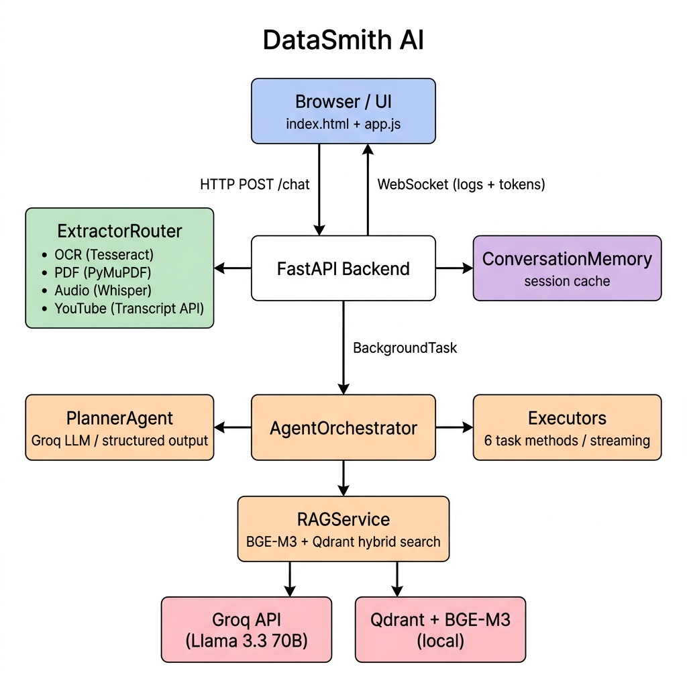

# DataSmith AI

An agentic AI app I built that takes text, images, PDFs, audio files or YouTube links and figures out what to do with them.

Upload a PDF and ask a question → it answers. Upload audio → it transcribes and summarizes. Upload a screenshot with code → explains it. If it can't figure out what you want, it asks you instead of guessing.

---

## Architecture



---

## What it can do

- handles text, PDF, image (jpg/png), audio (mp3/wav/m4a), and youtube links
- OCR for scanned PDFs and images (with confidence scoring)
- speech to text via Whisper (runs locally)
- intent detection - routes to the right task automatically
- asks follow-up if intent is unclear
- summarization, sentiment analysis, code explanation, action item extraction
- RAG using Qdrant + BGE-M3 for answering questions from uploaded docs
- live logs + streaming output over WebSocket

---

## Project layout


app/
├── agents/
│   ├── orchestrator.py    # ties everything together
│   ├── prompts.py         # all the LLM prompts in one place
│   └── cost_estimator.py
├── services/
│   ├── extractor.py       # routes files to right extractor
│   ├── pdf_service.py
│   ├── ocr_service.py
│   ├── audio_service.py
│   ├── youtube_service.py
│   └── rag_service.py
├── api/
│   ├── routes.py
│   └── websocket.py
├── core/
│   ├── config.py
│   ├── memory.py          # session context cache
│   └── logger.py
├── ui/
│   ├── index.html
│   └── app.js
└── main.py


---

## How it works (roughly)

1. user sends a message or uploads a file
2. content gets extracted based on file type
3. planner LLM reads the content and picks a task
4. if unclear, asks the user a follow-up question
5. executor runs the task and streams the response back
6. for document Q&A, relevant chunks are pulled from Qdrant first

---

## Setup

### Prerequisites (install these first, add to PATH)

- FFmpeg - needed for Whisper audio processing
- Tesseract OCR - needed for image/scanned PDF extraction

Also download the BGE-M3 model weights and update the path in `.env` or `config.py`.

### Install


pip install -r requirements.txt


### Environment

Create a `.env` file:

```
GROQ_API_KEY=your_key_here
GROQ_MODEL_NAME=llama-3.3-70b-versatile
BGE_M3_MODEL_PATH=D:/EmbeddingModels/bge-m3
```

### Run


python -m app.main


opens at http://localhost:8000

---

## Tech used

- FastAPI + Python
- Groq API (llama 3.3 70b)
- LangChain for LLM chaining
- Qdrant (local) + BGE-M3 for RAG
- Whisper for audio
- Tesseract + PyMuPDF for extraction
- Vanilla JS frontend with WebSocket

---

## Notes / known issues

- Qdrant runs locally using a file-based store (`./qdrant_db`), no docker needed
- OCR quality depends on image resolution - low confidence gets flagged automatically
- Whisper uses the `base` model by default, swap to `small` for better accuracy
- first startup is slow because Whisper + BGE-M3 both load on boot
- session memory is in-memory only, clears on restart

## Possible improvements

- per-session RAG isolation
- better chunk re-ranking
- docker setup
- streaming support for very long audio files
